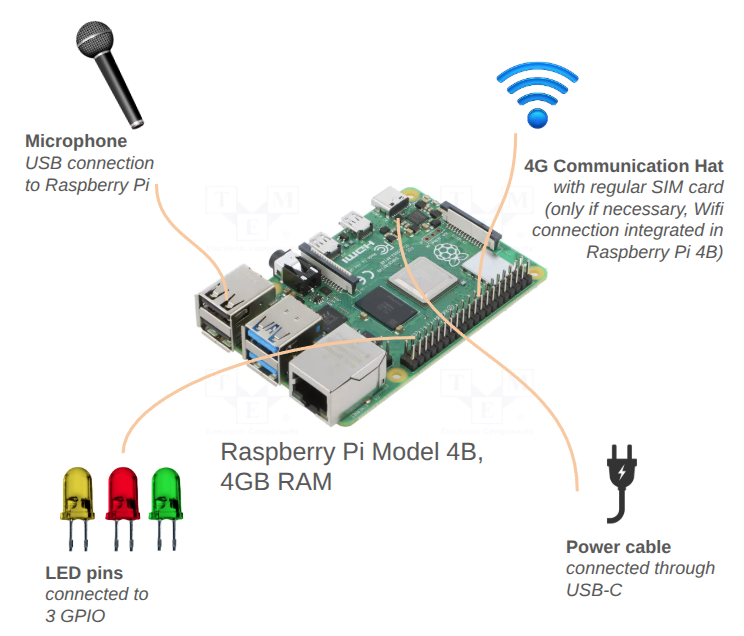

---
<!-- PROJECT LOGO -->

<div align="center">
  <a href="https://github.com/github_username/repo_name">
    
  </a>


  <p align="center">

  The Smart Environmental Noise System (SENS) is an advanced sensor technology designed for real-time acoustic monitoring, with a focus on urban environments. Built on a Raspberry Pi platform, SENS captures sound continuously and processes it locally using custom-developed software based on small and efficient artificial intelligence algorithms. SENS calculates acoustic parameters, including Sound Pressure Level (SPL), and makes predictions of the perceptual sound attributes of pleasantness and eventfulness (ISO 12913), along with detecting the presence of specific sound sources such as vehicles, birds, and human activity, among others. To safeguard privacy, all processing occurs directly on the device in real-time ensuring that no audio recordings are permanently stored or transferred. Additionally, the system transmits the extracted audio representation through the wireless network to a remote server, made possible using mobile data connectivity. SENS technology represents an innovative step in environmental noise monitoring, offering real-time processing and robust privacy protection. A single SENS device or a network of them could serve as a powerful tool for understanding the acoustic characteristics of soundscapes with efficiency and flexibility.

  </p>
  
</div>


<!-- ABOUT THE PROJECT -->
## About The Project

This work was supported by the project ''Soundlights: Distributed Open Sensors Network and Citizen Science for the Collective Management of the City's Sound Environments'' (9382417), a collaboration between the <i>Music Technology Group (Universitat Pompeu Fabra)</i> and <i>Bitlab Cooperativa Cultural</i>.

It is funded by <i>BIT Habitat (Ajuntament de Barcelona)</i> under the program <i>La Ciutat Proactiva</i>; and by the <i>IA y Música: Cátedra en Inteligencia Artificial y Música</i> (TSI-100929-2023-1) by the <i>Secretaría de Estado de Digitalización e Inteligencia Artificial</i> and <i>NextGenerationEU</i> under the program <i>Cátedras ENIA 2022</i>. 

<p>
  
  
  
  
</p>

<p align="right">(<a href="#readme-top">back to top</a>)</p>
<p></p>

## Reference
- Amaia Sagasti, Frederic Font, Xavier Serra: *SENS (Smart Environmental Noise System)* - Urban Sound Symposium 2025 <a href="https://zenodo.org/records/15341990">Poster Link Zenodo</a>
- Amaia Sagasti, Martín Rocamora, Frederic Font: *Prediction of Pleasantness and Eventfulness Perceptual Sound Qualities in Urban Soundscapes* - DCASE Workshop 2024 <a href="https://dcase.community/documents/workshop2024/proceedings/DCASE2024Workshop_Sagasti_12.pdf">Paper link DCASE webpage</a>
- Amaia Sagasti Martínez - MASTER THESIS: *Prediction of Pleasantness and Eventfulness Perceptual Sound Qualities in Urban Soundscapes* - Sound and Music Computing Master (Music Technology Group, Universitat Pompeu Fabra - Barcelona) <a href="https://zenodo.org/records/13861445">Master Thesis Report link Zenodo</a>

## Guide
SENS combines hardware and software in an intelligent acoustic sensor for monitoring urban spaces. Nevertheless, the software can work on its own, allowing to use SENS technology on any device with a microphone (like a laptop). Additionally, SENS algorithm can be simulated on a pre-recorded audio. See the section details that suit best your needs:

1. [Build SENS hardware and software](#build-sens-hardware-and-software)
2. [Run SENS software on device](#run-sens-software-on-device)
3. [Simulate SENS](#simulate-sens)

You can find the trained models in *data/models*.


## Build SENS hardware and software
SENS is implemented in a RaspberryPi model B 4GB RAM with 64-bit architecture operative system. The device has a microphone connected as well as a Mobile Network Hat with a SIM card. Additionally, three LED pins are connected and configured to signal the correct performance of the sensor. The ensembled components are placed inside an IP67 plastic case. 




To run the software, first, follow de instructions in [Environment set up](#environment-set-up) to prepare your working environment. Download the required models from <a href="https://zenodo.org/records/15348686">Zenodo</a> and place them in **sens-sensor/data/models/**. Then, it is advised to check [Code Structure](#code-structure) to understand how the code works. Do not forget to calibrate the microphone, check [Microphone calibration](#microphone-calibration). To run, simply do
```
# Open three terminals and activate the environment in all of them

cd sens-sensor

# Terminal 1
python main_send.py [microphone input, integer]

# Terminal 2
python main_process.py

# Terminal 3
python main_send.py
```

Some notes:
- Suggestion for microphone: <a href="https://www.amazon.es/Fyvadio-USB-Omnidireccional-Condensador-podcasting/dp/B0BZNJSMVM/ref=sr_1_6?__mk_es_ES=%C3%85M%C3%85%C5%BD%C3%95%C3%91&crid=1IR6ON690I2J3&dib=eyJ2IjoiMSJ9.K67IehFtlRZDS5jBrdkCYYtb-skINASIKTINaz5NkCtzrL_167PaXa-g2esglBhg89pV4vAZS8oU03mxm78ptzrMjhlJrFH8ZWtMB1S8LTnSCe80w5IU4abV1LUlSfehrP4NbqzSUZDgDHUB0Y5Fo3fGEpsakZX6NQD7sUTQ0IHBt0aau_cy9i6bW5OGjXvt3SaK2KiHG24CsfBVLBD_-0SNMtMRVRxylXr1HHoZmUZaGJCCud3MzPBJ1b9pxjvM0rfMHIO4okzxPBnfxWnNYzkFYyeaFj1qLZHXH2QLkac.yPw6iXIBAhL2HEaX2wkDg-4M5ysw5Et6p3c8Ee6_LCo&dib_tag=se&keywords=usb+microphone&qid=1746446343&s=electronics&sprefix=usb+microphone%2Celectronics%2C139&sr=1-6">link</a>
- Suggestion for communication hat: <a href="https://www.amazon.es/Waveshare-4G-Raspberry-SIM7600E-H-Supports/dp/B07F1NSGQ8/ref=asc_df_B07F1NSGQ8?mcid=e40563a86cf538528ebeeb339119f94b&tag=googshopes-21&linkCode=df0&hvadid=699750349813&hvpos=&hvnetw=g&hvrand=5563297664507590566&hvpone=&hvptwo=&hvqmt=&hvdev=c&hvdvcmdl=&hvlocint=&hvlocphy=9198717&hvtargid=pla-562517396842&psc=1&gad_source=1">link</a>
- Suggestion for LED pins: <a href="https://www.amazon.es/VooGenzek-Semaforo-Pantalla-Compatible-Raspberry/dp/B09NDPFJ4W/ref=sr_1_8?__mk_es_ES=%C3%85M%C3%85%C5%BD%C3%95%C3%91&crid=8Y4TUX5OW0H3&dib=eyJ2IjoiMSJ9.sdCHTkJ-CSToBSNew5hmfo4h1uWa-S986b2gQN-hpBhfa6L4MP7WsKBM8aRU6OEVmiGZ_McB0lbzc0dWdKiSDQZdstQ_lTzVZeT3J0_l6mvMG44LXzHswrAl6EejmH5FjATyZq0BwykKWoFoB6aWnMqpIIUyeKFws0Tly-EI0Z354ovRiHJfqBbuEKMPH0kZtj6b2CJprn91J0n0qAb5y-GbvbDxpjxy226ICJrX4dEHvMWBXXPccwdaazcdAOQyGYbY3tM1D6uMD6npSlfqI8K6CSRpr18DPepn8XjLido.RgFGyjjaOIgxwImImDZsYfTZo7EHSdQNnAET8IErRgI&dib_tag=se&keywords=3+LED+raspberrypi&qid=1746446453&sprefix=3+led+raspberrypi%2Caps%2C92&sr=8-8">link</a>
- Suggestion for IP65 plastic case (check sizes): <a href="hhttps://www.amazon.es/conexiones-el%C3%A9ctricas-impermeable-electrica-derivacion/dp/B0DS2HGNXL/ref=sr_1_12?__mk_es_ES=%C3%85M%C3%85%C5%BD%C3%95%C3%91&crid=3OCESSQZRMVO9&dib=eyJ2IjoiMSJ9.GtOvPooWEPqbIsMS7RrnvygV7d42R749QaoVj59BgfRNpeBHTNcqzBlj-Ez4S0NPmWW7ZnazzbBkoyPlINtnWEs9ICi8nEBnI07mPi2zjy53Z-_wlgBfgd-Os3xtXO_mKAUlp606yLu5goUxydrnlfUrRqoQGDPsbUH5Bb17yrcleJEEv64tf2UkQ6601t7KvWctdrKVSDt-zYvGmKyBEsXakxm-60ReT-byBya9WQ9wKhzF41fgv42WSVSJya1EirEnzEV1JEA5RkfsJeibzQckGd8mxvkyJ1q-t8d4_Hk.hNf4c0wOxchAqV3GXPwzI4emSTMoytr51byfYXZVyEo&dib_tag=se&keywords=IP65+plastic+case&qid=1746446766&sprefix=ip65+plastic+case%2Caps%2C118&sr=8-12">link</a> 
- Internet data consumption: in our case, we were making predictions every 3 seconds (generating 20 predictions per minute), but sending one message for every batch of 10 predictions (so one send every 30 seconds approximately). Every message sent is about 20KB, which leads to 24 hours x 60 minutes x 2 messages x 20KB = **58MB per day** or **1'7GB per month**. We use SIM cards of 4GB of internet data.
- You will need to modify the "sending" part of the code structure to send the real-time predictions to your own server.
- You can modify the AI models that you want to use from *parameters.py*
- If you want the sensor to start running as soon as it boots, it is adviced to prepare three service files, one for each part (capturing, processing and sending).


*(Product links may be outdated)*

## Run SENS software on device

You can simply run the SENS code in any device that has a microphone input, like a laptop.

For this, you should, first, follow de instructions in [Environment set up](#environment-set-up) to prepare your working environment. Download the required models from <a href="https://zenodo.org/records/15348686">Zenodo</a> and place them in **sens-sensor/data/models/**. Then, it is advised to check [Code Structure](#code-structure) to understand how the code works. Do not forget to calibrate the microphone, check [Microphone calibration](#microphone-calibration). To run, simply do
```
# Open three terminals and activate the environment in all of them

cd sens-sensor

# Terminal 1
python main_send.py [microphone input, integer]

# Terminal 2
python main_process.py

# Terminal 3
python main_send.py
```

Some notes:
- You will need to modify the "sending" part of the code structure to send the real-time predictions to your own server.
- You can modify the AI models that you want to use from *parameters.py*
- If you want the sensor to start running as soon as it boots, it is adviced to prepare three service files, one for each part (capturing, processing and sending).


## Simulate SENS

We have prepared a little piece of code that simulates SENS functioning. This script will process an input pre-recorded audio file as if its audio was being captured by the microphone. This code returns the predictions that SENS algorithms generate as well as some graphs that display the results in a much more understandable way.

It is adviced to use this algorithm on short audios (< 1 minute) to have clearer output graphs. If you use a longer audio, graphs will not be as clear.

For this, you should, first, follow de instructions in [Environment set up](#environment-set-up) to prepare your working environment. Download the required models from <a href="https://zenodo.org/records/15348686">Zenodo</a> and place them in **sens-sensor/data/models/**. Then, simply run in a terminal:

```
cd sens-sensor

python simulate_SENS.py
```

Note: you may get errors with RPi.GPIO library as the code is expecting LED pins connected to the RaspberryPi. Simply delete this code lines.


## Environment set up
This section provides all the necessary information to set up the working environment. 

NOTE: This project is only compatible with 64-bit RaspberryPi architecture. Check your architecture by opening a terminal and running: 
```
uname -m
```

If the output is *aarch64*, you have a 64-bit ARM architecture --> COMPATIBLE

The followiing list details the set up process:
### 1) Download and install  ```Python=3.10.14``` 
Python 3.10.14 <a href=https://www.python.org/downloads/release/python-31014/>download web</a>. 

Follow instructions below (or <a href="https://www.enablegeek.com/tutorial/install-python-on-a-raspberry-pi-step-by-step-guide/#:~:text=Downloading%20Python,-The%20next%20step&text=Here's%20how%20to%20do%20it,latest%20version%20is%20Python%203.10">link</a>)
```
sudo apt-get update

sudo apt-get install build-essential tk-dev libncurses5-dev libncursesw5-dev libreadline6-dev libdb5.3-dev libgdbm-dev libsqlite3-dev libssl-dev libbz2-dev libexpat1-dev liblzma-dev zlib1g-dev libffi-dev portaudio19-dev

wget https://www.python.org/ftp/python/3.10.14/Python-3.10.14.tar.xz # or download directly from link above

# Navigate to directory where download is
tar -xvf Python-3.10.14.tar.xz

cd Python-3.10.14

./configure --enable-optimizations # be patient

make -j 4 # be waaay more patient here

sudo make altinstall

python3.10 --version # to verify installation
```


### 2) Install dependencies

It is recommended to create a virtual environment. Example with venv:
```
# Go to home directory

/usr/local/bin/python3.10 -m venv my_env

# to activate
source my_env/bin/activate

# to deactivate
my_env deactivate
```

This code uses <a href="https://github.com/LAION-AI/CLAP">LAION-AI's CLAP model</a>. Install CLAP with:

```
git clone https://github.com/LAION-AI/CLAP.git
```

Finally, install sens-sensor specific requirements. For that, navigate your terminal to the SENS project folder and run:
```
cd sens-sensor

pip install -r requirements.txt
```
Now you are ready to start using sens-sensor repository.

<p align="right">(<a href="#readme-top">back to top</a>)</p>

## Microphone calibration
SENS measures Leq and LAeq in real-time. The microphone needs to be calibrated. You can use the calibration you want, as long as in parameters.mic_calib_path you specify the file path to the txt file that contains the calibration factor by which the captured waveform needs to be multiplied in order to get the V_rms signal (from which we can calculate dBs). 

If you own a microphone calibrator that plays a 1KHz signal at the standard 94dB like <a href="https://www.amazon.es/Calibrador-digital-port%C3%A1til-medidor-medici%C3%B3n/dp/B01FFI2OAU?th=1">example</a>, simply activate the environment and run the following command in the terminal to calibrate:
```
python calibration.py [microphone input, integer]
```

## Code Structure

This schema presents the general workflow


The following three images indicate the 3 main processes that create SENS working. Each process is executed through a different python script that is called in different terminal windows.


<i>NOTE: All inputs indicated in orange color indicate that they are defined in <a href="parameters.py">parameters.py</a> This file contains all the configuration parameters, variables and paths to the necessary files.</i>

#### Other scripts
Together with the three main scripts, we provide extra code for other processes involved in SENS project context but not necessary to be run in the actual developped sensor.

- <a href="simulate_SENS.py">simulate_SENS.py</a>: This script simulates SENS sensor on a pre-recorded WAV audio. The input audio is analysed in chunks of audio data. The resulting output are saved in JSON files containing the predictions, Leq and LAeq of each audio chunk.

- <a href="main_send_lib.py">main_send_lib.py</a>: SENS sensor was used in an experiment developed in a library under the framework of a project called SOUNDLIGHTS. This project research how real-time message signs could be use to improve the acoustic quality. The sensor was connected through the wireless network to a LED screen (connected to another RaspberryPi). In this scenario, SENS was calculating SPL and predicting the presence of human activity. This information was sent to the LED screen together with a threshold value using this script. The LED screen interpreted the message and prompted different messages, with the goal to influence people behaviour inside the library. Additionally, the sensor through  main_send_lib.py also sends the resulting predictions to the remote server.


<!-- LICENSE -->
## License
See `LICENSE` for more information.<p align="right">(<a href="#readme-top">back to top</a>)</p>