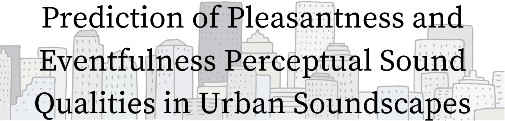

---
<!-- PROJECT LOGO -->

<div align="center">
  <a href="https://github.com/github_username/repo_name">
    
  </a>

<h3 align="center">Abstract</h3>

  <p align="center">
    Text here
  </p>
  
</div>

<!-- TABLE OF CONTENTS 
<details>
  <summary>Table of Contents</summary>
  <ol>
    <li>
      <a href="#about-the-project">About The Project</a>
      <ul>
        <li><a href="#built-with">Built With</a></li>
      </ul>
    </li>
    <li>
      <a href="#getting-started">Getting Started</a>
      <ul>
        <li><a href="#prerequisites">Prerequisites</a></li>
        <li><a href="#installation">Installation</a></li>
      </ul>
    </li>
    <li><a href="#usage">Usage</a></li>
    <li><a href="#roadmap">Roadmap</a></li>
    <li><a href="#contributing">Contributing</a></li>
    <li><a href="#license">License</a></li>
    <li><a href="#contact">Contact</a></li>
    <li><a href="#acknowledgments">Acknowledgments</a></li>
  </ol>
</details> -->

<!-- ABOUT THE PROJECT -->
## About The Project

This work was supported by the project ''Soundlights: Distributed Open Sensors Network and Citizen Science for the Collective Management of the City's Sound Environments'' (9382417), a collaboration between the <i>Music Technology Group (Universitat Pompeu Fabra)</i> and <i>Bitlab Cooperativa Cultural</i>.

It is funded by <i>BIT Habitat (Ajuntament de Barcelona)</i> under the program <i>La Ciutat Proactiva</i>; and by the <i>IA y Música: Cátedra en Inteligencia Artificial y Música</i> (TSI-100929-2023-1) by the <i>Secretaría de Estado de Digitalización e Inteligencia Artificial</i> and <i>NextGenerationEU</i> under the program <i>Cátedras ENIA 2022</i>. 

<p>
  
  
  
  
</p>

<p align="right">(<a href="#readme-top">back to top</a>)</p>
<p></p>

## Reference
- Amaia Sagasti, Martín Rocamora, Frederic Font: *Prediction of Pleasantness and Eventfulness Perceptual Sound Qualities in Urban Soundscapes* - DCASE Workshop 2024 <a href="https://dcase.community/documents/workshop2024/proceedings/DCASE2024Workshop_Sagasti_12.pdf">Paper link DCASE webpage</a>
- Amaia Sagasti Martínez - MASTER THESIS: *Prediction of Pleasantness and Eventfulness Perceptual Sound Qualities in Urban Soundscapes* - Sound and Music Computing Master (Music Technology Group, Universitat Pompeu Fabra - Barcelona) <a href="https://zenodo.org/records/13861445">Master Thesis Report link Zenodo</a>


<!-- GETTING STARTED -->
## Getting Started
**The code is implemented in a RaspberryPi model B. The device has a microphone connected as well as a Mobile Network Module with a SIM card.**

This section provides all the necessary information to set up the working environment. 

NOTE: This project is only compatible with 64-bit RaspberryPi architecture. Check your architecture by opening a terminal and running: 
```
uname -m
```

If the output is *aarch64*, you have a 64-bit ARM architecture --> COMPATIBLE

The followiing list details the set up process:
### 1) Download and install  ```Python=3.10.14``` 
Python 3.10.14 <a href=https://www.python.org/downloads/release/python-31014/>download web</a>. 

Follow instructions below (or <a href="https://www.enablegeek.com/tutorial/install-python-on-a-raspberry-pi-step-by-step-guide/#:~:text=Downloading%20Python,-The%20next%20step&text=Here's%20how%20to%20do%20it,latest%20version%20is%20Python%203.10">link</a>)
```
sudo apt-get update

sudo apt-get install build-essential tk-dev libncurses5-dev libncursesw5-dev libreadline6-dev libdb5.3-dev libgdbm-dev libsqlite3-dev libssl-dev libbz2-dev libexpat1-dev liblzma-dev zlib1g-dev libffi-dev

wget https://www.python.org/ftp/python/3.10.14/Python-3.10.14.tar.xz # or download directly from link above

# Navigate to directory where download is
tar -xvf Python-3.10.14.tar.xz

cd Python-3.10.14

./configure --enable-optimizations # be patient

make -j 4 # be waaay more patient here

sudo make altinstall

python3.10 --version # to verify installation
```


### 2) Install dependencies

It is recommended to create a virtual environment. Example with venv:
```
# Go to home directory

/usr/local/bin/python3.10 -m venv my_env

# to activate
source my_env/bin/activate

# to deactivate
my_env deactivate
```

This code uses <a href="https://github.com/LAION-AI/CLAP">LAION-AI's CLAP model</a>. Install CLAP with:

```
git clone https://github.com/LAION-AI/CLAP.git
```

Finally, install sens-sensor specific requirements. For that, navigate your terminal to the SENS project folder and run:
```
cd sens-sensor

pip install -r requirements.txt
```
Now you are ready to start using sens-sensor repository.

<p align="right">(<a href="#readme-top">back to top</a>)</p>

## RUN CODE ¡¡FIXME!!
This code runs in combination with *path/to/KeAcoustics/main.py* in order to have the sensor capturing sound, storing segments of audio files, deleting the oldest segments, and processing joint segments to make predictions of pleasantness, eventfulness and sound sources.

+ ***path/to/KeAcoustics/main.py*** code is in charge of recording the audio and handling the saving of audio segments. The following are the two main parameters to consider from *path/to/KeAcoustics/parameters.py*:
    - ```spl_time``` --> Time used for SPL average in seconds (time length of each segment)
    - ```maintain_time```--> Time in seconds that we want to preserved stored segments
  

+ In this code, ***path/to/calculation.py*** is in charge of reading the audio stored and making predictions.
 Firstly, it loads the model in initialization function.
 Then it joins the saved audio. The number of segments to join are given in n_segments function.
 Finally, the audio is used for the predictions, and these values are saved in a txt file.
  
  *NOTE: Run with the created environment*


+ Also in this code, ***path/to/main.py*** works similar to *calculation.py* but additionally sends the predictions via TCP to specified address
  ```
  python main.py <ip address> <ip port>
  ```
  *NOTE: Run with the created environment*


<!-- LICENSE -->
## License

Distributed under the ...<!-- MIT License. See `LICENSE.txt` for more information.<p align="right">(<a href="#readme-top">back to top</a>)</p>-->
