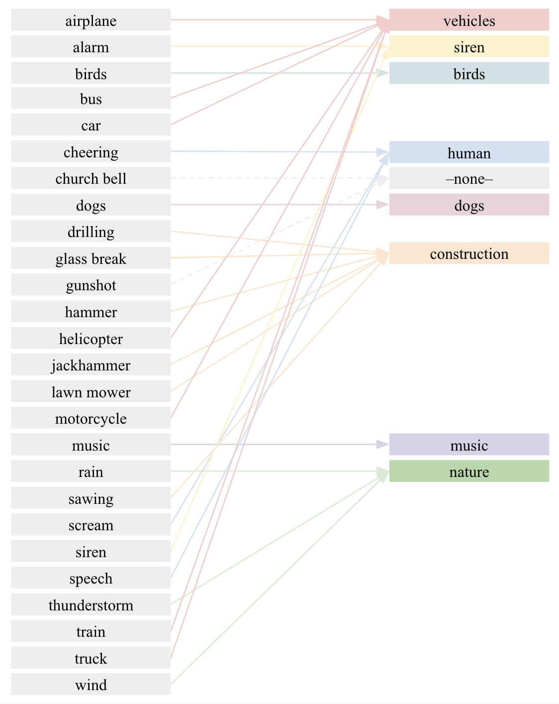

# SENS development
This section of the repository includes the code to train models that predict the perceptual qualities of Pleasantness and Eventfulness, and sound sources like vehicles, birds, dogs, construction... 

To allow reproducibility of the model generation, we provide information about the datasets that were used and how they were processed, as well as the code to generate the new feature set that was then used to train the prediction models.

In the following chart you can find a quick summary of the models generated and links to the sections of this README that explain the complete process in further detail.

| Original Dataset                     | Used for training models that predict...                                                                                  | Link to section                                                          |
| ------------------------------------ | ------------------------------------------------------------------------------------------------------------------------- | ------------------------------------------------------------------------ |
| ARAUS dataset                        | pleasantness, eventfulness                                                                                                | <a href="#araus---pleasantness-and-eventfulness-prediction">Section </a> |
| Urban Sound Monitoring (USM) Dataset | birds, construction, dogs, human, music, nature, siren, vehicles                                                          | <a href="#usm---sound-sources-prediction">Section </a>                   |
| UrbanSound8k Dataset (US8k)          | air conditioner, car horn, children playing, dog bark, drilling, engine idling, gun shot, jackhammer, siren, street music | <a href="#us8k---sound-sources-prediction">Section </a>                  |


## ARAUS - PLEASANTNESS AND EVENTFULNESS PREDICTION

This section of the repository includes the code to train models that predict the perceptual qualities of Pleasantness and Eventfulness (this is fundamented on previous research, detailed information in the documents proposed in <a href="#references">References section</a>).

The following bullet points constitute the keys for the development of these models.

- **Dataset** 
  
  We use the augmented soundscapes proposed in <a href="https://github.com/ntudsp/araus-dataset-baseline-models"> ARAUS dataset </a>. 

- **Features** 
  
  <a href="https://github.com/LAION-AI/CLAP">LAION-AI's CLAP model</a> is used to generate the sound representations for the augmented soundscapes. In particular, we use LAION-AI's pre-trained model *630k-fusion-best.pt*.

  ```
  # sens-sensor/data tree
  ├── data
  │   ├── models
  │   │   ├── 630k-fusion-best.pt
  ```

- **Test set** 
  
  ARAUS dataset provides more than 25k augmented soundscapes organised in 5 folds for cross-validation plus an additional fold ('fold-0') for testing. However, we include an additional fold for testing ('fold-Fs') formed of 25 real audios obtained from the Freesound library. 


## Reproducibility of model creation

In order to reproduce the creation of the models for predicting Pleasantness and Eventfulness, the following steps need to be followed, indicated with the neccessary instructions and code:

1) Download ARAUS dataset and source code from <a href="https://github.com/ntudsp/araus-dataset-baseline-models"> ARAUS Github page </a>. Once installation process is completed and the necessary files have been downloaded as indicated, run the script below to generate the 25k augmented soundscapes.

   ``` 
   araus-dataset-baselines-models/code/make_augmented_soundscapes.py
   ```
   **From ARAUS dataset we are only making use of these 25k augmented soundscapes WAV files and the file ```responses.csv```. The rest of the code or files is not neccessary from now on. Locate this files in the following way**
   ```
   # sens-sensor/data tree
    ├── data 
    │   ├── files
    │   │   ├── responses.csv
    │   └── soundscapes_augmented
    │       ├── fold_0_participant_10001_stimulus_02.wav
    │       ├── ...
    │       └── fold_5_participant_00600_stimulus_44.wav
   ```

2) After some research (see <a href="#references">References section</a>), CLAP embeddings demonstrated strong performance in terms of prediction accuracy and suitability for real-time processing. The steps below determine the guide to obtain the dataset to train the models, which includes the CLAP embeddings for ARAUS augmented audios as well as for Fold-Fs audios too.
   
   *NOTE: Set up your environment following the instructions in <a href="#environment-configuration">Environment configuration section</a>.*

   1) Adapt ARAUS original dataset for extension 
        
        <a href="PE_dataset_Adequation.ipynb">PE_dataset_Adequation.ipynb</a> offers a guide of the adaptation needed prior to the CLAP embeddings generation. It recieves as input ```data/files/responses.csv``` (file from ARAUS original dataset) and outputs ```responses_adapted.csv```.

        ``` 
        # sens-sensor/data tree
          ├── data 
          │   ├── files
          │   │   ├── responses.csv
          │   │   ├── responses_adapted.csv
          │   │   └── responses_fold_Fs.csv # Manually generated with new data
        ```

   2) Generate dataset
        
        <a href="PE_dataset_Generation.py">PE_dataset_Generation.py</a> generates single JSON files, a general JSON and a general CSV with the embeddings for the set of audios indicated. 

        It must be run in the command line with
        ```
        python development/dataset_Generate_features.py --data_path path/to/data/folder --type araus
        # for generating CLAP dataset for ARAUS dataset augmented soundscapes, requires responses_adapted.csv in data/files/

        python development/dataset_Generate_features.py --data_path path/to/data/folder --type new
        # for generating CLAP dataset for fold-Fs soundscape audios, requires responses_fold_Fs.csv in data/files/

        python development/dataset_Generate_features.py --data_path path/to/data/folder --type both
        # for both
        ```

        This will result in the following files, containing the new datasets: CLAP embeddings for each audio + metainformation.
        ```
        ├── data
        │   ├── files
        │   │   ├── ARAUS_CLAP_dataset
        │   │   │   ├── ARAUS_CLAP_dataset.csv
        │   │   │   └── ARAUS_CLAP_dataset.json
        │   │   ├── fold_Fs_CLAP_dataset
        │   │   │   ├── fold-Fs_CLAP_dataset.csv
        │   │   │   └── fold-Fs_CLAP_dataset.json
        ```

    3) Train model
   
        <a href="PE_model_Training.py">PE_model_Training.py</a> trains two models for predicting pleasantness and eventfulness, respectively, using RFR algorithm.

        It must be run in the command line with

        ```
        python development/PE_model_Training.py --data_path path/to/data/folder
        ```
        This will result in the following files:
        ```
        ├── data
        │   ├── models
        │   │   ├── model_eventfulness.joblib
        │   │   ├── model_pleasantness.joblib
        ```

## USM - SOUND SOURCES PREDICTION
This section of the repository includes the code to train models that predict the sound sources birds, construction, dogs, human, music, nature, siren, vehicles.

The following bullet points constitute the keys for the development of these models.

- **Dataset** 
  
  We use the mixed soundscapes proposed in <a href="https://github.com/jakobabesser/USM"> USM dataset </a>. 

- **Features** 
  
  <a href="https://github.com/LAION-AI/CLAP">LAION-AI's CLAP model</a> is used to generate the sound representations for the soundscapes. In particular, we use LAION-AI's pre-trained model *630k-fusion-best.pt*.

  ```
  # sens-sensor/data tree
  ├── data
  │   ├── models
  │   │   ├── 630k-fusion-best.pt
  ```


## Reproducibility of model creation
In order to reproduce the creation of the models for predicting the sound sources birds, construction, dogs, human, music, nature, siren, vehicles; the following steps need to be followed, indicated with the neccessary instructions and code:

1) Download USM dataset <a href="https://github.com/jakobabesser/USM"> USM Github page </a>. Once installation process is completed and the necessary files have been downloaded as indicated, locate them in the data folder:

   ``` 
    # sens-sensor/data tree
    ├── data
    │   ├── USM
    │   │   ├── class_labels.csv
    │   │   ├── eval
    │   │   ├── train
    │   │   └── val
   ```
   **From USM dataset we are only making use of the WAV files and npy files of the mixed audios.**


2) After some research (see <a href="#references">References section</a>), CLAP embeddings demonstrated strong performance in terms of prediction accuracy and suitability for real-time processing. The steps below determine the guide to obtain the dataset to train the models.
   
   *NOTE: Set up your environment following the instructions in <a href="#environment-configuration">Environment configuration section</a>.*

   1) Adapt USM original dataset for extension 
        
        <a href="Sources_USM_dataset_Adequation.ipynb">Sources_USM_dataset_Adequation.ipynb</a> offers a guide of the adaptation needed. It reads all USM data, deleting the files that are not needed, and simplifies the sound sources provided by USM dataset following the mapping below. It generates a ```_simp.npy``` version for each audio, containing the binary vector of the active sources.

        <p>
          
        </p>


        ``` 
        # sens-sensor/data tree
          ├── data
          │   ├── USM
          │   │   ├── class_labels.csv
          │   │   ├── eval
          │   │   │   ├── 0_mix_target_simp.npy # new
          │   │   │   ├── 0_mix_target.npy      # original
          │   │   │   ├── 0_mix.wav             # original 
          │   │   │   ├── ...    
          │   │   ├── train
          │   │   └── val
        ```

   2) Generate dataset
        
        <a href="Sources_USM_dataset_Generation.py">Sources_USM_dataset_Generation.py</a> generates a general JSON and a general CSV with the embeddings for the set of audios indicated. 

        It must be run in the command line with
        ```
        python development/Sources_USM_dataset_Generation.py --data_path path/to/data/folder
        ```

        This will result in the following files, containing the new datasets: CLAP embeddings for each audio + metainformation.
        ```
        ├── data
        │   ├── files
        │   │   ├── USM_CLAP_dataset
        │   │   │   ├── USM_CLAP_dataset.csv
        │   │   │   └── USM_CLAP_dataset.json
        ```

    3) Train model
   
        <a href="Sources_USM_model_Training.py">Sources_USM_model_Training.py</a> trains models for predicting the corresponding sources, respectively, using a variety of algorithms (indicated in the python file).

        It must be run in the command line with

        ```
        python development/Sources_USM_model_Training.py --data_path path/to/data/folder
        ```
        This will result in the following files:
        ```
        ├── data
        │   ├── models
        │   │   └── sources_USM
        │   │       ├── birds.joblib
        │   │       ├── birds_model_info.txt
        │   │       ├── construction.joblib
        │   │       ├── construction_model_info.txt
        │   │       ├── dogs.joblib
        │   │       ├── dogs_model_info.txt
        │   │       ├── human.joblib
        │   │       ├── human_model_info.txt
        │   │       ├── music.joblib
        │   │       ├── music_model_info.txt
        │   │       ├── nature.joblib
        │   │       ├── nature_model_info.txt
        │   │       ├── siren.joblib
        │   │       ├── siren_model_info.txt
        │   │       ├── vehicles.joblib
        │   │       └── vehicles_model_info.txt
        ```


## US8k - SOUND SOURCES PREDICTION
This section of the repository includes the code to train models that predict the sound sources air conditioner, car horn, children playing, dog bark, drilling, engine idling, gun shot, jackhammer, siren, street music.

The following bullet points constitute the keys for the development of these models.

- **Dataset** 
  
  We use the audios proposed in <a href="https://urbansounddataset.weebly.com/urbansound8k.html"> Urban Soundscapes 8k dataset </a>. 

- **Features** 
  
  <a href="https://github.com/LAION-AI/CLAP">LAION-AI's CLAP model</a> is used to generate the sound representations for the soundscapes. In particular, we use LAION-AI's pre-trained model *630k-fusion-best.pt*.

  ```
  # sens-sensor/data tree
  ├── data
  │   ├── models
  │   │   ├── 630k-fusion-best.pt
  ```


## Reproducibility of model creation
In order to reproduce the creation of the models for predicting the sound sources birds, construction, dogs, human, music, nature, siren, vehicles; the following steps need to be followed, indicated with the neccessary instructions and code:

1) Download US8k dataset <a href="https://urbansounddataset.weebly.com/urbansound8k.html"> US8k webpage </a>. Once installation processed is completed and the necessary files have been downloaded as indicated, locate them in the data folder:

   ``` 
    # sens-sensor/data tree
    ├── data
    │   ├── UrbanSoundscapes8K
    │   │   ├── audio
    │   │   │   ├── fold1
    │   │   │   ├── fold2
    │   │   │   ├── fold3
    │   │   │   ├── fold4
    │   │   │   ├── fold5
    │   │   │   ├── fold6
    │   │   │   ├── fold7
    │   │   │   ├── fold8
    │   │   │   └── fold9
    │   │   └── metadata
    │   │       ├── UrbanSound8K.csv

   ```
   **From US8k dataset we are only making use of the WAV files and UrbanSound8K.csv**


2) After some research (see <a href="#references">References section</a>), CLAP embeddings demonstrated strong performance in terms of prediction accuracy and suitability for real-time processing. The steps below determine the guide to obtain the dataset to train the models.
   
   *NOTE: Set up your environment following the instructions in <a href="#environment-configuration">Environment configuration section</a>.*

   1) Adapt US8k original dataset for extension 
        
        <a href="Sources_US8k_dataset_Adequation.ipynb">Sources_US8k_dataset_Adequation.ipynb</a> offers a guide of the adaptation needed. It reads UrbanSound8K.csv, adding one column per sound source. Each of these columns contains binary information 1 or 0 depending on the presence of the sound source in the audio. Additionally, a new source and column "construction" is added mapping the sources "drilling" or "jackhammer". The output is  UrbanSound8K_adapted.csv.
        ``` 
        # sens-sensor/data tree
          ├── data
          │   ├── files
          │   │   ├── UrbanSound8K_adapted.csv

        ```

   1) Generate dataset
        
        <a href="Sources_US8k_dataset_Generation.py">Sources_US8k_dataset_Generation.py</a> generates a general JSON and a general CSV with the embeddings for the set of audios indicated. 

        It must be run in the command line with
        ```
        python development/Sources_US8k_dataset_Generation.py --data_path path/to/data/folder
        ```

        This will result in the following files, containing the new datasets: CLAP embeddings for each audio + metainformation.
        ```
        ├── data
        │   ├── files
        │   │   ├── UrbanSound8K_CLAP_dataset
        │   │   │   ├── UrbanSound8K_CLAP_dataset.csv
        │   │   │   └── UrbanSound8K_CLAP_dataset.json
        │   │   ├── UrbanSound8K_adapted.csv
        ```

    2) Train model
   
        <a href="Sources_US8k_model_Training.py">Sources_US8k_model_Training.py</a> trains models for predicting the corresponding source, respectively, using the algorithms indicated in the python file.

        It must be run in the command line with

        ```
        python development/Sources_US8k_model_Training.py --data_path path/to/data/folder
        ```
        This will result in the following files:
        ```
        ├── data
        │   ├── models
        │   │   └── sources_US8k
        │   │   │   ├── air_conditioner.joblib
        │   │   │   ├── air_conditioner_model_info.txt
        │   │   │   ├── car_horn.joblib
        │   │   │   ├── car_horn_model_info.txt
        │   │   │   ├── children_playing.joblib
        │   │   │   ├── children_playing_model_info.txt
        │   │   │   ├── construction.joblib
        │   │   │   ├── construction_model_info.txt
        │   │   │   ├── dog_bark.joblib
        │   │   │   ├── dog_bark_model_info.txt
        │   │   │   ├── drilling.joblib
        │   │   │   ├── drilling_model_info.txt
        │   │   │   ├── engine_idling.joblib
        │   │   │   ├── engine_idling_model_info.txt
        │   │   │   ├── gun_shot.joblib
        │   │   │   ├── gun_shot_model_info.txt
        │   │   │   ├── jackhammer.joblib
        │   │   │   ├── jackhammer_model_info.txt
        │   │   │   ├── siren.joblib
        │   │   │   ├── siren_model_info.txt
        │   │   │   ├── street_music.joblib
        │   │   │   └── street_music_model_info.txt
        ```
## PCA transformation
The very same procedures that where presented in the sections above can be performed with or without PCA transformation applied to the 512-length CLAP embedding generated, resulting in a 50-length input vector to the models.

Check <a href="PCA_generation.ipynb">PCA_generation.ipynb</a> to see the analysis we perform in order to find that 50 components were enough to explain 95% of the CLAP embeddings variability. In this script we save the PCA transform we use.

Run <a href="PCA_testing.py">PCA_testing.py</a> to see the improvement it makes to incorporate the PCA to the system.


## Environment configuration
Check section in the main project README.

## References
- Amaia Sagasti, Martín Rocamora, Frederic Font: *Prediction of Pleasantness and Eventfulness Perceptual Sound Qualities in Urban Soundscapes* - DCASE Workshop 2024 <a href="https://dcase.community/documents/workshop2024/proceedings/DCASE2024Workshop_Sagasti_12.pdf">Paper link DCASE webpage</a>
- Amaia Sagasti Martínez - MASTER THESIS: *Prediction of Pleasantness and Eventfulness Perceptual Sound Qualities in Urban Soundscapes* - Sound and Music Computing Master (Music Technology Group, Universitat Pompeu Fabra - Barcelona) <a href="https://zenodo.org/records/13861445">Master Thesis Report link Zenodo</a>
